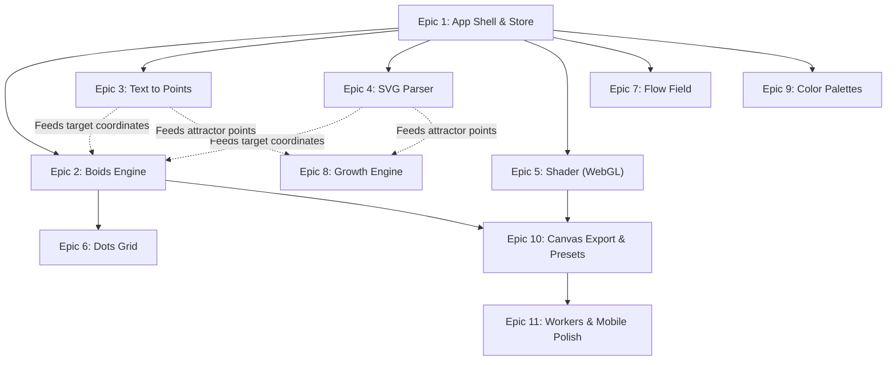

# TASKS

Status: `[ ]` todo · `[~]` in progress / partial · `[x]` done

Current implementation checkpoint:
- Phase 1 MVP is implemented and builds successfully.
- Phase 2 core engines and file/preset features are implemented at a functional baseline.
- Remaining gaps are mostly optional advanced export/renderers and deeper production hardening.

---

## Systematic Planning & Estimates

Before beginning development, review these dependencies to prevent architectural blockages:

### Epic Dependency & Effort Estimation Table

| Epic | Module Name | Core Dependencies | Target Target Outputs | Estimated Effort |
| :--- | :--- | :--- | :--- | :--- |
| **Epic 1** | App Shell & Base Store | None | Layout grid, State shell | **1.5 Days** |
| **Epic 2** | Boids flocking simulator | Epic 1 | Particle physics solver | **2.0 Days** |
| **Epic 3** | Text Glyphs point-sampler | Epic 1 | opentype path → normalized dots | **1.5 Days** |
| **Epic 4** | SVG Curve rasterizer | Epic 1 | svgson parser → Web Worker | **2.0 Days** |
| **Epic 5** | WebGL Shader engine | Epic 1 | regl/glsl context & backgrounds | **2.5 Days** |
| **Epic 6** | Grid Dots renderer | Epic 2 | Spatial overlay of grid values | **1.0 Day** |
| **Epic 7** | Flow Field simulator | Epic 1 | Simplex/Curl noise flow lines | **1.5 Days** |
| **Epic 8** | Growth Veins generator | Epic 3, 4 | Generates root geometries | **2.0 Days** |
| **Epic 9** | Custom Palette manager | Epic 1 | Color presets & randomizer | **1.0 Day** |
| **Epic 10** | Composite Export & Presets | Epic 2, 5 | Canvas PNG merger & JSON load | **2.0 Days** |
| **Epic 11** | Mobile UX & Web Workers | Epics 1-10 | Final UI speed polish | **2.0 Days** |

**Total Estimated MVP Effort**: **19.0 Developer-Days** (assuming 8 hours per developer-day).

---

## Epic 1 — App Shell

- [x] Init Vite + React + TypeScript + Tailwind
- [x] Setup Hybrid FSD-Lite directory structure (app, pages, widgets, features, engines, entities, shared)
- [x] Two-column layout (left panel 280px, right canvas)
- [x] Mode tabs (Custom · Shader · Dots · Flow · Growth)
- [x] Zustand store with default AppState
- [x] Responsive canvas preview (square, centered)
- [x] Play / pause / reset controls
- [x] Canvas size switcher (400 / 800 / 1080)
- [x] Dark theme base — superseded by latest direction: UI follows `DESIGN.md` light interface; canvas palettes follow `UI_SPEC.md`

---

## Epic 2 — Boids Engine

- [x] Vec2 class with add, scale, limit, dist
- [x] Boid class: pos, vel, acc
- [x] Separation rule
- [x] Alignment rule
- [x] Cohesion rule
- [x] Target attraction toward point cloud
- [x] Wrap / bounce toggle
- [x] Trail rendering (fade canvas each frame)
- [x] Spatial grid optimization
- [x] Sliders: count, speed, view distance, separation, alignment, cohesion, target force, trail

---

## Epic 3 — Text Engine

- [x] Text input field
- [x] Default system font path via Canvas2D `measureText` / path approach
- [x] opentype.js integration for real path extraction
- [x] Font upload (.ttf / .otf)
- [x] Glyph → bezier → sampled Vec2[]
- [x] Normalize points to canvas size
- [x] Re-sample on text or font change
- [x] Font size slider
- [x] Preview text outline (toggle)

---

## Epic 4 — SVG Engine

- [x] SVG file upload (FileReader)
- [x] svgson parse → path elements
- [x] Flatten cubic/quadratic beziers to polyline
- [x] Sample points by arc length
- [x] Normalize / fit-center to canvas
- [x] Multi-path support
- [x] Fill area sampling (offscreen canvas rasterize)
- [x] Error fallback for unsupported SVG

---

## Epic 5 — Shader Engine

- [x] WebGL context on second canvas
- [x] Fullscreen quad setup
- [x] Uniform pipeline: time, resolution, distortion, swirl, grain, palette
- [x] Shader preset: `liquid.frag.glsl`
- [x] Shader preset: `grain.frag.glsl`
- [x] Shader preset: `terrain.frag.glsl`
- [x] Palette uniforms from store (5 colors)
- [x] Sliders: speed, distortion, swirl, grain
- [x] Graceful fallback if WebGL unavailable

---

## Epic 6 — Dots Engine

- [x] Generate grid of points based on canvas size
- [x] Per-dot influence from boid proximity
- [x] Render dots at computed opacity/scale
- [x] Density / spacing slider
- [x] Influence radius slider

---

## Epic 7 — Flow Field Engine

- [x] Simplex noise implementation (or import)
- [x] Curl noise from noise gradient
- [x] Vector field grid (cell size configurable)
- [x] Particles follow field
- [x] Trail drawing with fade
- [x] Sliders: noise scale, turbulence, particle count, trail length, speed

---

## Epic 8 — Growth Engine

- [x] Attractor point set (from text/SVG sample)
- [x] Growth tip data structure
- [x] Nearest attractor search
- [x] Segment extension per frame
- [x] Branch logic on attractor reach
- [x] Draw segments as strokes
- [x] Sliders: step size, branch angle, max branches, attractor count

---

## Epic 9 — Palette & Style

- [x] 5-swatch palette editor (color pickers)
- [x] Background color picker
- [x] Foreground / particle color picker
- [x] Randomize palette button (curated random, always looks good)
- [x] Preset palettes (5 named palettes)

---

## Epic 10 — Export

- [x] PNG export from canvas (2D + composited WebGL)
- [x] JSON preset export (serialize AppState)
- [x] JSON preset import (validate + apply)
- [x] Preset examples (load 3 built-in presets)

---

## Epic 11 — Polish

- [x] Slider debounce (heavy recompute on text/SVG change)
- [x] Loading state during font/SVG parsing
- [x] Error messages (bad SVG, bad font)
- [x] Keyboard shortcut: Space = pause, R = reset, E = export
- [x] Mobile-friendly layout (stacked, collapsible panel)
- [x] About / credits modal

---

## Epic 12 — Visual Presets (from mood board)

See `docs/VISUAL_PRESETS.md` for full spec of each.

### Phase 1 presets (implement with existing engines)
- [x] **Vortex Dashes** — Flow field + capsule renderer, curl vortex (ref: image 1)
- [x] **Dense Blob Vortex** — Flow field + blob renderer, high density (ref: image 2)
- [x] **Liquid Symmetry** — Shader liquid + quad mirror + grid overlay (ref: image 3)
- [x] **Paint Swirl** — Shader fluid advection, no particles (ref: image 4)
- [x] **Tiger Wave** — Shader diagonal stripe with glow (ref: image 8)
### Phase 2 presets (need new renderers)
- [x] **Mosaic Squares** — Canvas cell renderer with concentric squares (ref: image 5)
- [x] **Voronoi Cells** — GLSL Voronoi distance field + edge glow, monochrome (ref: image 6)
- [x] **Isometric Voxel** — Noise heightmap + Canvas 2D isometric cube renderer (ref: image 7)
### Shared
- [x] Add `PALETTE_STUDIO_DARK` as default palette in `state/presets.ts`
- [x] Capsule shape renderer in flow field engine
- [x] Blob shape renderer in flow field engine
- [x] Symmetry transform layer (none / mirror / quad / radial)
- [x] Mosaic cell renderer module
- [x] Voronoi GLSL shader
- [x] Isometric voxel renderer module

---

## Phase 2 Backlog (not MVP)

- [ ] GIF export (ffmpeg.wasm)
- [ ] MP4 export
- [ ] Shareable URL (query param serialization)
- [ ] Halftone renderer
- [ ] Plotter / SVG line export
- [ ] Audio reactive mode
- [ ] Morphing between two sources
- [ ] Reaction-diffusion engine
- [ ] Image input (brightness → force field)
- [ ] Multi-layer composition
